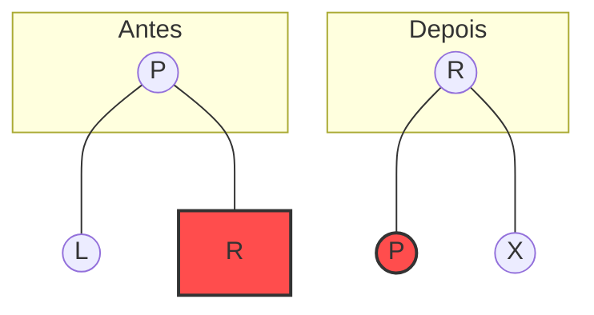

# Árvore Rubro-Negra Esquerdita (LLRB)

A **Árvore Rubro-Negra Esquerdita** (*Left-Leaning Red-Black Tree*) é uma variante da Árvore Rubro-Negra clássica, proposta por Robert Sedgewick. Sua principal vantagem é a simplicidade de implementação, mantendo uma correspondência direta de 1 para 1 com as **Árvores 2-3**.

---

## 📋 Propriedades Fundamentais

Para que uma árvore seja considerada uma LLRB, ela deve satisfazer as seguintes regras:

1.  **Cores**: Todo nó é ou **Vermelho** ou **Preto**.
2.  **Raiz**: A raiz é sempre **Preta**.
3.  **Folhas**: Todas as folhas (nós `NULL`) são consideradas **Pretas**.
4.  **Inexistência de Vermelhos Consecutivos**: Um nó vermelho não pode ter um filho vermelho (não há dois links vermelhos seguidos).
5.  **Equilíbrio Negro**: Todo caminho da raiz até uma folha deve conter o mesmo número de nós pretos (altura negra).
6.  **Inclinação à Esquerda**: Links vermelhos devem obrigatoriamente ser filhos **esquerdos**. Se um nó tem um filho vermelho, ele deve ser o da esquerda.

---

## 🔄 Operações de Rotação e Ajuste

Diferente da Rubro-Negra tradicional que possui muitos casos, a LLRB utiliza três operações básicas aplicadas durante a recursão da inserção:

### 1. Rotação à Esquerda (`rotateLeft`)
Usada quando um link vermelho "inclina" para a direita. Ela o transforma em um link à esquerda.



### 2. Rotação à Direita (`rotateRight`)
Usada quando temos dois links vermelhos seguidos à esquerda (representando um nó 4 temporário).

### 3. Inversão de Cores (`flipColors`)
Usada quando um nó possui ambos os filhos vermelhos. Isso "sobe" a cor vermelha para o pai, dividindo o nó 2-3-4.

---

## 🚀 Logística de Inserção

A inserção na LLRB é elegante pois os ajustes são feitos no "retorno" da recursão.

### Pseudocódigo de Ajuste:
```c
if (isRed(h->right) && !isRed(h->left))      h = rotateLeft(h);
if (isRed(h->left) && isRed(h->left->left)) h = rotateRight(h);
if (isRed(h->left) && isRed(h->right))      flipColors(h);
```

---

## 💻 Implementação em C

Aqui está uma estrutura básica para sua implementação:

```c
#include <stdio.h>
#include <stdlib.h>

#define RED 1
#define BLACK 0

typedef struct Node {
    int key;
    struct Node *left, *right;
    int color;
} Node;

int isRed(Node *x) {
    if (x == NULL) return BLACK;
    return x->color == RED;
}

Node* rotateLeft(Node *h) {
    Node *x = h->right;
    h->right = x->left;
    x->left = h;
    x->color = h->color;
    h->color = RED;
    return x;
}

Node* rotateRight(Node *h) {
    Node *x = h->left;
    h->left = x->right;
    x->right = h;
    x->color = h->color;
    h->color = RED;
    return x;
}

void flipColors(Node *h) {
    h->color = RED;
    h->left->color = BLACK;
    h->right->color = BLACK;
}

Node* insert(Node *h, int key) {
    if (h == NULL) {
        Node *n = (Node*)malloc(sizeof(Node));
        n->key = key;
        n->left = n->right = NULL;
        n->color = RED;
        return n;
    }

    if (key < h->key) h->left = insert(h->left, key);
    else if (key > h->key) h->right = insert(h->right, key);

    // Ajustes de balanceamento (o segredo da LLRB)
    if (isRed(h->right) && !isRed(h->left))      h = rotateLeft(h);
    if (isRed(h->left) && isRed(h->left->left)) h = rotateRight(h);
    if (isRed(h->left) && isRed(h->right))      flipColors(h);

    return h;
}
```

---

## 📊 Complexidade

| Operação | Complexidade |
| :--- | :--- |
| **Busca** | $O(\log n)$ |
| **Inserção** | $O(\log n)$ |
| **Remoção** | $O(\log n)$ |
| **Espaço** | $O(n)$ |

> [!TIP]
> A LLRB é excelente para sistemas que precisam de buscas rápidas e inserções frequentes sem a complexidade de código de uma AVL ou de uma Rubro-Negra tradicional.
